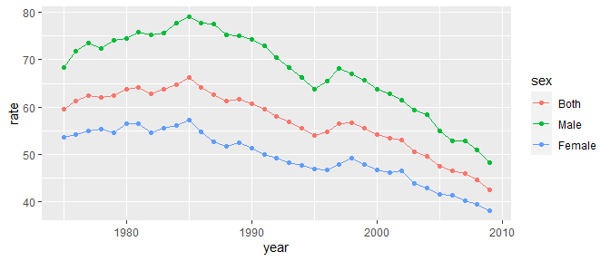
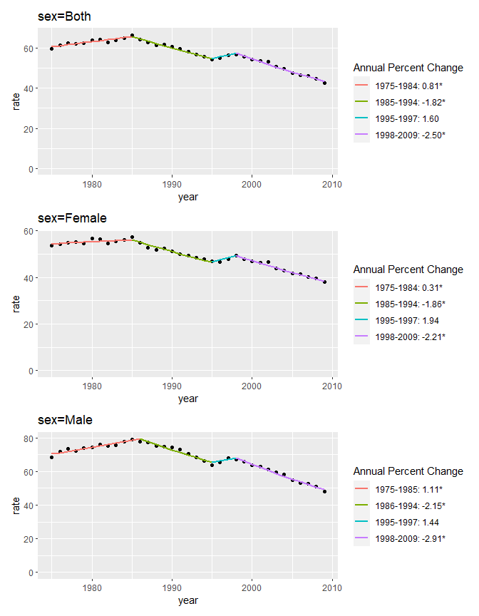

<!-- README.md is generated from README.Rmd. Please edit that file -->

# {nih.joinpoint}

<!-- badges: start -->

[](http://www.gnu.org/licenses/gpl-3.0.html) [](https://lifecycle.r-lib.org/articles/stages.html) [](https://github.com/DanChaltiel/nih.joinpoint/) [](https://CRAN.R-project.org/package=nih.joinpoint)

## Joinpoint Regression Software

The package `{nih.joinpoint}` is an R interface to easily use National Institute of Health (NIH)'s 'Joinpoint Regression Software' v4.9.0.0.

You will need the Command-Line version (available [here](https://surveillance.cancer.gov/joinpoint/callable/)). This package **will not work** on the graphical version (Joinpoint Desktop Software).

> **Disclaimer**:\
> According to the [Terms of Use Agreement](https://surveillance.cancer.gov/joinpoint/callable/personal_joinpoint_agreement.doc) from NIH, I am not allowed to share a copy of the software\
> You need to apply at <https://surveillance.cancer.gov/joinpoint/callable/> to get your own copy. This package will **NOT** work otherwise.\
> If you want to cite this package in a publication, you will have to cite NIH as well.

The NIH software will come as a Windows installer that needs to be installed. If you cannot or don't want to install it in the default location ("C:/Program Files (x86)/Joinpoint Command/jpCommand.exe"), you should use `options(joinpoint_path="my/path/to/jp.exe")`.

This package comes with no guarantee that it will work for any other version than v4.9.0.0.

## Package Installation

As for now, you can only install the development version of this package from GitHub:

``` r
devtools::install_github("DanChaltiel/nih.joinpoint")
```

## Lifecycle: experimental

This package is still in its experimental phase, so breaking changes might happen in the future.

Therefore, you should probably use [`renv`](https://rstudio.github.io/renv/articles/renv.html) in your project so that your old code will run even if you update this package.

When the interface is mature enough, this package will be released on CRAN.

## Dataset

This package includes a part of the sample dataset provided with the software:

``` r
library(tidyverse)
library(nih.joinpoint)

nih_sample_data %>% group_by(sex) %>% slice(1, 2, n()-1, n()) #first 2 and last 2 of each group
#> # A tibble: 12 x 4
#> # Groups:   sex [3]
#>    sex     year  rate    se
#>    <fct>  <dbl> <dbl> <dbl>
#>  1 Both    1975  59.5 0.622
#>  2 Both    1976  61.4 0.626
#>  3 Both    2008  44.7 0.395
#>  4 Both    2009  42.6 0.382
#>  5 Male    1975  68.4 1.07 
#>  6 Male    1976  71.7 1.08 
#>  7 Male    2008  51.0 0.639
#>  8 Male    2009  48.2 0.614
#>  9 Female  1975  53.6 0.770
#> 10 Female  1976  54.1 0.767
#> 11 Female  2008  39.5 0.500
#> 12 Female  2009  38.1 0.488

ggplot(nih_sample_data, aes(x=year, y=rate, color=sex)) + geom_point() + geom_line()
```



## Parameters

You can use `run_options()` and `export_options()` to setup parameters for the joinpoint analysis:

``` r
run_opt = run_options(model="ln", max_joinpoints=3, n_cores=3)
export_opt = export_options()
```

In this example, we ask for a log-linear model, with a maximum of 3 joinpoints to be found, using 3 cores of your processor to parallelize to computing. See `?run_options()` for more options.\
Export options are left as default as they often mess with the output, change them if you know what you are doing.

Note that the computing time will increase exponentially with `max_joinpoints` and will decrease with `n_cores`.

## Run

To run the analysis, you then call `joinpoint()` with arguments: your dataset, the variables you want to consider, and the above-mentioned options.

``` r
jp = joinpoint(nih_sample_data, x=year, y=rate, by=sex, se=se,
               run_opts=run_opt, export_opts=export_opt)
names(jp)
#> [1] "aapc"           "apc"            "data_export"    "selected_model"
#> [5] "perm_test"      "report"         "run_summary"
```

Note that you can leave the options as default, and that the standard error can be left unfilled:

``` r
jp2 = joinpoint(nih_sample_data, x=year, y=rate, 
                run_opts=run_opt)
```

Note though that by default this latter example used a single core to find a max of 4 joinpoints. It took 20 minutes to run on my computer, compared to 4 seconds for the first example.

## Plotting

You can use `jp_plot()` to plot the joinpoint lines along the scatter points:

``` r
jp_plot(jp)
```



The result is a [patchwork](https://github.com/thomasp85/patchwork/) of ggplots, as the legend must be different for every level.

Note that you can use `by_level` to filter specific groups:

``` r
jp_plot(jp, by_level=c("Male", "Female"))
```

## Logging

You can look at the logs using `cat()`:

``` r
cat(jp$run_summary)
#> ----------------------
#> Joinpoint Version Info
#> ----------------------
#> Program Name = C:\PROGRA~2\JOINPO~2\JPCOMM~1.EXE
#> Program Version = V4.9.0.0.1
#> Execution Time = 3 seconds
#> 
#> -------------------
#> Joinpoint Run Files
#> -------------------
#> Run File = session_run.ini
#> Session File = ini/session_ini.ini
#> Data File = session_run.ini
#> Session Options File = ini/run_opt_ini.ini
#> Output Options File = ini/export_opt_ini.ini
#> Joinpoint Output File = session_run.jpo
#> 
#> -------------------------
#> Joinpoint Session Options
#> -------------------------
#>  Model Specifications:
#> 
#>     Independent Variable                             =  year
#>     Shift Data Points by                             =  0.000000
#> 
#>     Dependent Variable:
#>       Calculated or Provided                        =  Provided
#>       Type                                          =  Age-Adjusted Rate
#> 
#>     Type of Change Point Model                       =  Joinpoint
#>     Loglinear Model                                  =  Yes {ln(y) = xb}
#>     Heteroscedastic Errors Model                     =  Standard Error (Provided)
#> 
#>     By Variables:
#>       sex
#> 
#>     Method                                           =  Grid Search
#>     Autocorrelation Errors                           =  Uncorrelated
#> 
#>     Minimum Number of Joinpoints                     =  0
#>     Maximum Number of Joinpoints                     =  3
#> 
#>     Minimum Number Obs Before First Joinpoint        =  2
#>     Minimum Number Obs Between Two Joinpoints        =  2
#>     Number of Grid Points Between Data Points        =  0
#> 
#>     Model Selection Method                           =  Permutation Test
#>     Overall Significance Level of Permutation Tests  =  0.0500
#>     Number of Permutations to Perform for Each Test  =  4499
#>     Seed for Randomly Permuting Data                 =  7160
#>     Joinpoint Significance Level                     =  0.0500
#>     APC Significance Level                           =  0.0500
#>     AAPC Significance Level                          =  0.0500
#>     Jump Value and CR Significance Level             =  Not Applicable
#> 
#>     AAPC Confidence Interval Method                  =  Parametric
#> 
#>     Jump Model / Comparability Ratio                 =  Disable
#>       Jump Location                                  =  Not Applicable
#>       Comparability Ratio                            =  Not Applicable
#>       Variance of CR                                 =  Not Applicable
#> 
#>     Comparison Type                                  =  None
#>       Pairwise Comparison                            =  Not Applicable
```
